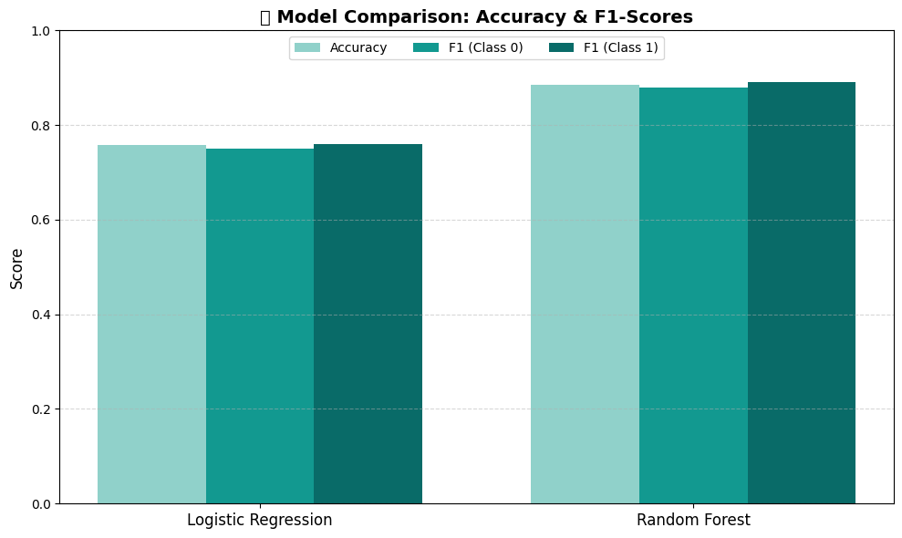
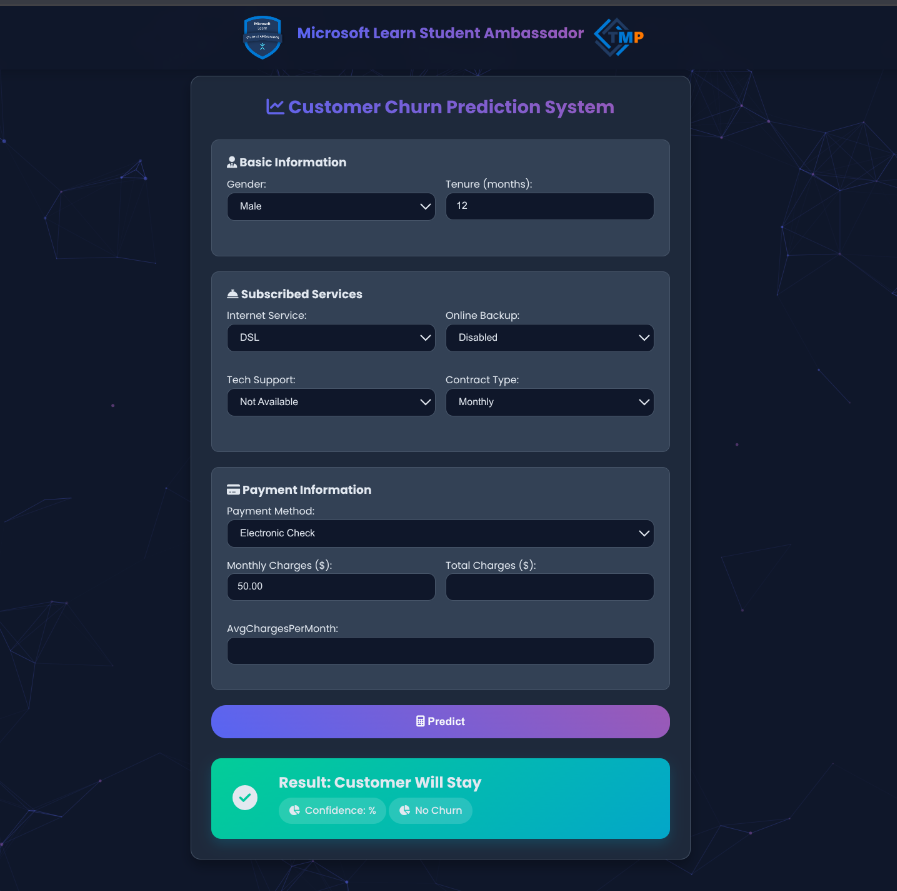

# MLSA-PROJECT

## 🏗️ Project Architecture

The project follows a clean and modular structure:


---text

MLSA-PROJECT/
│
├── Data/
│ └── Final Project MLSA- Dataset.csv
│
├── Note_Book/
│ └── Customer Churn Prediction.ipynb
│
├── PDF_FILES/
│ ├── Final Project- MLSA.pdf
│ ├── MLSA.pdf
│ └── MLSA.pptx
│
├── images/
│ ├── output.png
│ └── screenshot.png
│
├── static/
│ ├── css/
│ ├── js/
│ └── images/
│
├── templates/
│ └── index.html
│
├── app.py
├── rf_model.joblib
├── scaler.joblib
├── requirements.txt
├── Procfile
└── README.md


### 🔄 Workflow
```txt
User Input → Flask (app.py) → Preprocessing → Model Prediction → Output
```
# 📊 Customer Churn Prediction Web App

This is a Flask-based web application that predicts whether a customer is likely to churn (leave a service) based on their service usage and contract information. The model is trained using a Random Forest Classifier and provides both the prediction and the probability of churn.

---

## 🚀 Features

- 🔍 **Churn Prediction** — Predict whether a customer will churn based on input data.
- 📈 **Probability Score** — Displays the confidence percentage for each prediction.
- 🎛️ **Auto-fill Defaults** — Pre-filled default values for quick testing.
- ✅ **Input Validation & Handling** — Handles missing or invalid values intelligently.
- 💡 **Label Encoding & Scaling** — Categorical and numerical preprocessing are applied consistently.

---

## 🛠️ Technologies Used

- **Flask** — Web framework for Python.
- **scikit-learn** — For model training and preprocessing.
- **Pandas** — Data manipulation.
- **Joblib** — Model and scaler serialization.
- **HTML + Jinja2** — For frontend templating.

---

## 🧠 Machine Learning Model

- **Model:** Random Forest Classifier
- **Target Variable:** Churn (Yes/No)
- **Features Used:**
  - Gender
  - Tenure
  - Internet Service
  - Online Backup
  - Tech Support
  - Contract Type
  - Payment Method
  - Monthly Charges
  - Total Charges
  - Average Charges per Month

---

## 📷 Screenshot



---

## 💻 How to Run Locally

### 1. Clone the Repository

```bash
git clone https://github.com/yourusername/churn-prediction-flask.git
cd churn-prediction-flask
```
### 2. Install Dependencies

Create a virtual environment (optional but recommended):

```bash
python -m venv venv
source venv/bin/activate  # On Windows use: venv\Scripts\activate
```

Then install the requirements:

```bash
pip install -r requirements.txt
```

### 3. Add Required Files

Make sure the following files are present in the project directory:

* `rf_model.joblib` — Trained Random Forest model
* `scaler.joblib` — Scaler object used for numeric features
* `templates/index.html` — HTML form interface

### 4. Run the App

```bash
python app.py
```

Then visit [https://mlsa-project-production.up.railway.app/](https://mlsa-project-production.up.railway.app/) in your browser.

---

## 📷 Screenshot



---

## 📝 Example Input

| Feature           | Example Value  |
| ----------------- | -------------- |
| Gender            | Male           |
| Tenure            | 12             |
| Internet Service  | DSL            |
| Online Backup     | No             |
| Tech Support      | Yes            |
| Contract          | Month-to-month |
| Payment Method    | Credit card    |
| Monthly Charges   | 70.50          |
| Total Charges     | 846.00         |
| Avg Charges/Month | 70.50          |

---

## 🙌 Credits

Developed by [MLSA TEAM](MLSA TEAM)
Inspired by real-world business needs for customer retention strategies.

